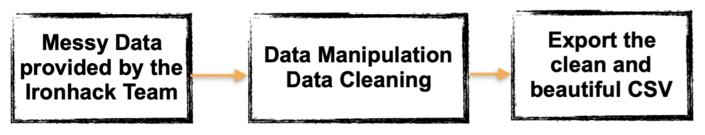

# Ironhack - Data Analytics Bootcamp
***
## Project 2 - Shark Attacks

Data Cleaning and Manipulation

### Main Objectives

The dataset provided by Ironhack contains significantly messy data. Your job is to apply the different cleaning and manipulation techniques to generate a cleaner CSV version of this data.

### Main Objectives - HINT: Make yourself focused

Ask a question to the dataset and try to answer it using data. This will focus your cleaning and data manipulation through the process.

### More Objectives

In the process of answering that question, we believe you’ll feel the need of some tools like:
- Visualization techniques;
- Statistics;
- More data sources;
All of which we’ll handle in near future.

### The Data Set

- Go to kaggle.com and create an account;
- Go to the search bar and look for ‘Global Shark Attacks’;
- Download the data set;
- For more info: https://www.sharkattackfile.net.

### Deliverables

- A clean CSV file on your GitHub account;
- The url of the file on your GitHub. It should be able to be read using "pd.read_csv(url)";
- The link to the Jupyter notebook (or the GitHub project);

### Deadline

- The same day.

### Methodology:

When we analyzed this data set, we realized that the best approach would be to organize it based on the date on which the accidents occurred, which in addition to facilitating the search for past cases, makes it possible to know the times of the year and the periods of the day when they usually occur. Therefore, we chose the following steps:

- importing modules "pandas", "numpy", "regex" and "datetime";
- reading the file using pandas methods (head, info and shape);
- cleaning the data set, dropping columns and rows with no or very few data and similar columns;
- date treatment with the creation of three columns containing the years, days and months of the accidents;
- time treatment by standardizing the format of the time when the accidents occurred;
- creation of a new column with four day periods (morning, afternoon, night and "wee hours");
- standardization of the sex field for better visualization and manipulation of data: "M" for male and "F" for female;
- cleaning and changing formats of the field "age" for better visualization and manipulation of data;
- changing the field "fatal" to "True" or "False", for better manipulation of the data; and
- organizing all the columns of the data set in a more logical way, such as placing "activity", "type", "injury" and "fatal" next to each other.

### Technologies used:

- Python
- Pandas

***
## Colaborators:

- Marcus Brandão

- Pedro Di Gianni
***
