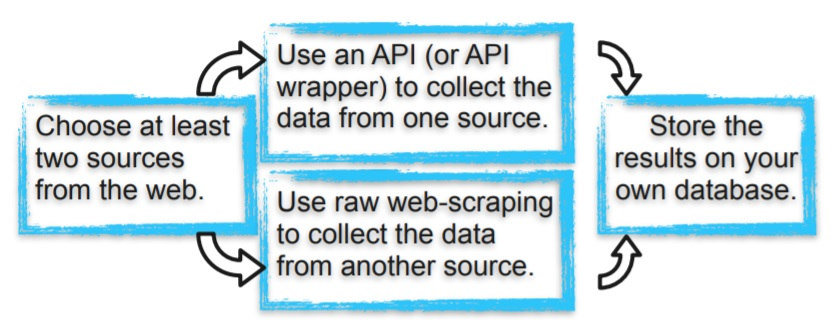

# Ironhack - Data Analytics Bootcamp
***
## Project 3 - Data gathering processes

Web Scraping and Databases.

### Main Objectives

The main objective of this project is to train your skills on obtaining data from different sources and safely storing it in a database. This will also help your develop skills in designing good process workflows.

### Specific Objectives

1. You will create one code to generate structured data from an API (or API wrapper);
2. You will create another code to generate structured data from raw web-scraping (using beautiful-soup or any related tool you prefer);
3. You will design and create your database with the structured data obtained;
4. Do not forget to document the process.

### Hints

- Keep in mind that you can try to use this database later in the course. So it would be better if you choose something you are familiar with / you are interested in.
- It would be lovely if you could relate both sources. That is, if you could later use both of your sources in the same context.

### Deliverables

- The url of your Jupyter Notebook files on your GitHub.
- The dump of your database.
- [EXTRA] Draw the Entity-Relationship-Diagram of your database (https://app.quickdatabasediagrams.com/#/)

***
## The project:

### Chosing the  sources for this project:

In this project we chose to create a dataframe containg information about the companies that are part of the Standard & Poor's 500, a stock market index that measures the stock performance of 500 large companies listed on stock exchanges in the United States.

After doing some research, we decided to use the Yahoo Finance API¹ which, depite being discontinued,  is free, succinct and contains the quotes of most of the shares contained in S&P 500.

However, this API presented some usage problems. There was a lack of information on some of the tickers, companies and quotes surveyed or the information was out of date.

Therefore, we decided to get most of the information from another source by raw web-scraping. For this 

We did some research and decided to use Wikipedia², considering that this site has a good and reliable table with the information we needed about the S&P 500 companies. In addition, the table proved to be easy to be web-scraped.

Finally we decided that the dataframe to be created would have the following information about the companies:

- Symbol (or ticker);
- Security (or name);
- SEC filings;
- GICS Sector;
- GICS Sub Industry;
- Headquarters Location;
- Date first added;
- CIK;
- Founded;
- 2019 third quarter quotes;
- 2019 fourth quarter quotes;
- 2020 first quarter quotes; and
- 2020 second quarter quotes;

### Sources used:

1 - Yahoo Finance API:
https://rapidapi.com/apidojo/api/yahoo-finance1 or
https://english.api.rakuten.net/apidojo/api/yahoo-finance1

2 - List of S&P 500 companies: https://en.wikipedia.org/wiki/List_of_S%26P_500_companies

### Steps taken:

- Importing all the modules and libraries that we needed;
- Saving the url to be scraped in the variable url_sp500;
- Scraping the url using the Bautiful Sopu Python library;
- Getting the first table from the scraped url;
- Creating a pandas dataframe based on the scraped table;
- Saving the tickers from the dataframe into a list to be used to get information from de Yahoo Finance API;
- Searching for data in the Yahoo Finance API using the tickers from the created list;
- Getting the open rates from Yahoo Finance API for the four desired quarters passing the initial dates of the quarters;
- Using parallelization to get the open rates faster;
- Getting the close rates from Yahoo Finance API for the last desired quarter passing the last date of the quarter;
- Using parallelization to get the close rates faster;
- Creating five columns in the sp500 dataframe with the obtained rates;
- Creating a dataframe with all 18 the companies containing NaN to have a register of the companies without useful data;
- Dropping lines in which all values are NaN;
- Cleaning the 'Headquarters Location' column and creating lists of the 'states' and the 'countries':
- Showing the Final dataframe containing 487 of the 505 S&P500 stocks; and
- Exporting the final dataframe to a csv format file.

### Problems faced:

- The Yahoo Finance API appears to be out of date and is slow to work;
- if the imputed date is a weekend day or a holiday, it will not return any value, such as the quote from the previous Friday or the last valid date recorded;
- Yahoo Finance API does not return rates for some dates or some companies; and
- 'Headquarters Location' column had data in different patterns and had to be cleaned. 

### Technologies used:

- Python;
- Pandas;
- Numpy;
- Beautiful Soup;
- Yahoo Finance API;
- Future;
- Json;
- Multiprocess;
- Operator;
- Regex;
- Requests;
- Tqdm; and
- Urllib.

***
## Colaborators:

- [Marcus Brandão](https://www.linkedin.com/in/marcusffbrandao)

- Pelle Adamsen
***

