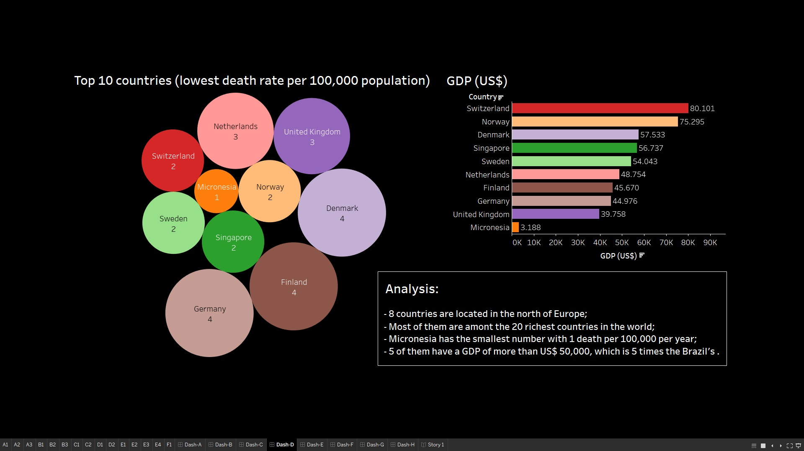

# Ironhack - Data Analytics Bootcamp

## Project 6 - Final Project

Free choice.

### Main Objective

The objective of this project is the application of one or more methodologies and tools learned during the course.

### Deliverables

- Presentation of your project - 7 minutes;
- Link to github and/or tableau project;
- Summary of your main insights.

## The Project:

###  ROAD TRAFFIC DEATHS IN THE WORLD IN 2016

In this project I chose to analyze some serious problem present in most countries in the world. Therefore, I took a look at the [Global Health Observatory](https://apps.who.int/gho/data/node.main) data repository, available on the World Health Organization website, and chose to analyze the road traffic deaths in the world in 2016, the most recent date available. For that, I downloaded the following dataframes:

[Road traffic deaths (Data by country)](https://apps.who.int/gho/data/node.main.A997?lang=en);

[Reported distribution of road traffic deaths by type of road user (Data by country)](https://apps.who.int/gho/data/node.main.A998?lang=en);

[Registered vehicles (Data by country)](https://apps.who.int/gho/data/node.main.A995?lang=en);

I also found it necessary to obtain some information on the socio-economic level of each country analyzed. For this, I chose the [Gross Domestic Product per Capita - GDP (nominal)](https://en.wikipedia.org/wiki/List_of_countries_by_GDP_(nominal)_per_capita), which is a good measure to analize a country's wealth and social development.

I chose to get the United Nations rank, through web scraping from the [Wikipedia](https://en.wikipedia.org/wiki/List_of_countries_by_GDP_(nominal)_per_capita) website, among the three dataframes available there, because its data is from 2017, the closest date to 2016, that is the date of the other dataframes used in this work.

Then, after cleaning and merging the four dataframes, the analysis was made through Tableau Software.

#### Methodology:

1. I downloaded the three dataframes from the World Health Organization website;
2. I imported Pandas libray and Regex;
3. I imported the first dataframe containing the "road traffic deaths by country";
4. I cleaned it, dropping useless data, reorganizing and renamimng some columns;
5. I mported the second dataframe containing the "registered vehicles by country";
6. I eliminated the spaces in the column "Number of registered vehicles" and changed its type to float;
7. I imported the third dataframe containing the "reported distribution of road traffic deaths by type of road user by country";
8. I eliminated the non-numeric characters from the items in the column ' Drivers/passengers of 4-wheeled vehicles':
9. I Dropped the duplicate row for the country 'Eswatini'
10. I web scraped the United Nations table with the countries of the world sorted by their gross domestic product per capita from Wikipedia;
11. I dropped the column 'Rank', renamed the remaining columns and the countries whose names were different than in the previous dataframes;
12. I merged the three WHO dataframes into a new one;
13. I renamed the countries whose names were different in a way that it would be recognizable by Tableau maps.
14. I merged the GDP dataframe with the three WHO dataframes into a new one;
15. I dropped null data and the columns 'Data Source','Year_x', and 'Year_y';
16. I exported the final dataframe as a ".csv" file.
17. I imported the file into Tableau;
18. I created 8 dashboards and a story to analize the dataframe created.

#### Problems faced:

- The dataframes had data obtained in different years, from 2012 to 2017, therefore, there were some minor inconsistencies;
- Country names had to be standardized before merging the dataframes;
- Tableau is not as intuitive as it looks;

#### Technologies used:

- Python;
- Pandas;
- Tableau.

#### Tableau views:

a) The name of the project: "ROAD TRAFFIC DEATHS IN THE WORLD IN 2016 - Exploratory Data Analysis": 
 

 
 
b) Top 10 countries (total number of deaths): 
 

 
 
c) Top 10 countries (death rate per 100,000 population): 
 

 
 
d) Top 10 countries (lowest total number of deaths): 
 

 
 
e) Top 10 countries (lowest death rate per 100,000 population): 
 

 
 
f) Top 10 countries (distribution of road traffic deaths by type of road user): 
 

 
 
g) Top 20 in number of registered vehicles / Total road traffic deaths: 
 

 
 
h) Conclusion: 
 

 
 
___________________________________________________________________________________________________________________________

## Tableau link for the project:

https://public.tableau.com/profile/marcus.brand.o#!/vizhome/Roadtrafficdeathsbycountry-2016/Dash-F?publish=yes
___________________________________________________________________________________________________________________________

## Colaborator:

[Marcus Brandão](https://www.linkedin.com/in/marcusffbrandao)
___________________________________________________________________________________________________________________________
